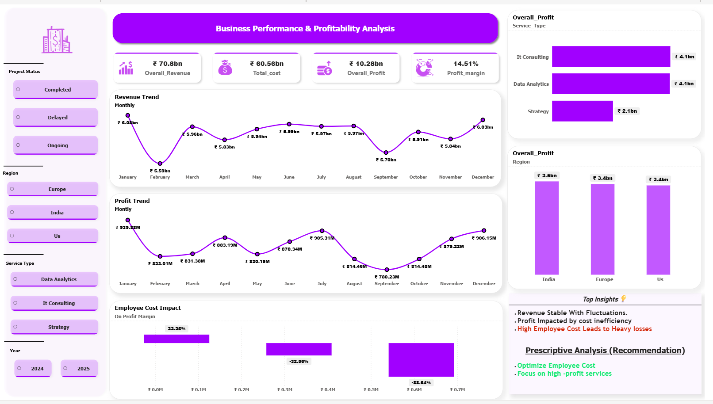

# 📊 Business Performance & Profitability Analysis Dashboard

## 🚀 Project Overview
This project focuses on analyzing business performance and profitability using a consulting-style dataset stored in a PostgreSQL database. The objective is to identify key drivers of revenue and profit, uncover inefficiencies, and provide actionable business insights.

An interactive dashboard was developed using Power BI, connected directly to PostgreSQL, enabling dynamic and scalable data analysis.

---

## 🎯 Objectives
- Analyze revenue, cost, and profit trends over time  
- Identify high-performing and underperforming business segments  
- Perform root cause analysis on profit fluctuations  
- Build predictive insights using forecasting  
- Provide business recommendations for improving profitability  

---

## 🛠️ Tools & Technologies Used
- PostgreSQL – Data storage & database management  
- Power BI – Data visualization & dashboard creation  
- Power Query – Data cleaning & transformation  
- DAX (Data Analysis Expressions) – Measures & calculations  
- Excel (Optional) – Initial dataset preparation  

---

## 🗄️ Database Integration (PostgreSQL)
- Imported dataset into PostgreSQL database  
- Created structured tables for project data  
- Connected Power BI to PostgreSQL using database connector  
- Enabled scalable and real-time data analysis  

---

## 📂 Dataset Description
The dataset simulates a consulting/IT business environment and includes:

- Project ID  
- Client Name  
- Service Type (IT Consulting, Data Analytics, Strategy)  
- Region (India, Europe, US)  
- Project Status (Completed, Ongoing, Delayed)  
- Revenue  
- Employee Cost  
- Operational Cost  
- Discount  
- Hours Worked  
- Start Date  

---

## 🧹 Data Cleaning & Preparation
Performed using Power Query:

- Handled missing values in revenue, discount, and cost fields  
- Removed invalid/negative operational cost values  
- Standardized currency formats  
- Converted data types (date, numeric, text)  
- Created calculated columns for analysis  

---

## 📊 Analysis Performed

### 1️⃣ Descriptive Analysis (What Happened?)
- Revenue trend over time  
- Profit trend over time  
- KPI metrics (Revenue, Cost, Profit, Profit Margin)  
- Performance by Service Type and Region  

---

### 2️⃣ Diagnostic Analysis (Why It Happened?)
- Segment analysis by service and region  
- Root Cause Analysis:
  - Employee Cost vs Profit Margin  
- Identified key factors affecting profitability  

---

### 3️⃣ Predictive Analysis (What Will Happen?)
- Applied forecasting on profit trends  
- Estimated future performance using historical data  

---

### 4️⃣ Prescriptive Analysis (What Should Be Done?)
- Derived actionable recommendations based on insights  

---

## 🔍 Key Insights

- Revenue remains stable with periodic fluctuations  
- Profit shows higher volatility due to cost inefficiencies  
- IT Consulting and Data Analytics are top-performing services  
- Strategy services underperform compared to others  
- 🔴 High employee cost significantly reduces profit margin:
  - Low cost → Positive margin (~22%)  
  - Medium cost → Negative margin (~ -32%)  
  - High cost → Heavy losses (~ -88%)  

---

## 💡 Business Recommendations

- Optimize employee cost in high-budget projects  
- Improve resource allocation and workforce efficiency  
- Focus on high-performing services  
- Re-evaluate low-performing service segments  
- Strengthen cost control strategies  

---

## 📈 Dashboard Features

- KPI Cards (Revenue, Cost, Profit, Margin)  
- Monthly Revenue & Profit Trends  
- Service-wise Performance  
- Region-wise Performance  
- Employee Cost Impact Analysis  
- Forecasting (Predictive Analysis)  
- Interactive Filters:
  - Region  
  - Service Type  
  - Project Status  
  - Year  

---

## 🧠 Key Learning Outcomes- End-to-end data analysis workflow  
- Working with PostgreSQL databases  
- Data cleaning using Power Query  
- Building interactive dashboards in Power BI  
- Applying descriptive, diagnostic, predictive, and prescriptive analytics  

---

## 📌 Conclusion

This project demonstrates how integrating databases like PostgreSQL with Power BI enables scalable and efficient business analysis, helping organizations make data-driven decisions.

---

## 📷 Dashboard Preview

---

## 👤 Author  

**Name:** Marikannan S  
**Role:** Data Analyst (Fresher)  
**Skills:** Power BI | Excel | SQL | Python  
**Location:** Tiruchirappalli, India  
**LinkedIn:** [linkedin.com/in/marikannan21](www.linkedin.com/in/marikannan21)  
**Email:** marikannan.official.21@gmail.com  

---

## 🔗 Links  

- 🌐 **Live Power BI Dashboard:** [https://app.powerbi.com/view?r=eyJrIjoiZTY0MTRkYjYtNmRkOC00ODgwLWE0ZjctZWI1NGRiYTAzMjVhIiwidCI6IjhlZTRhZmYyLWIwM2QtNGRlOC04MWEwLTk5ZTJmODhjNGVlYiJ9&pageName=6a87daf1005ed1799dd7]  

**LinkedIn Post:** [linkedin.com/in/marikannan21](https://www.linkedin.com/posts/marikannan21_dataanalytics-powerbi-postgresql-ugcPost-7447266435141124097-B58B?utm_source=share&utm_medium=member_desktop&rcm=ACoAAD6lXGkBJUiVH2nxdg8wZZxcHrYN2X8ZFHs) 

---

## ⭐ If you found this project useful
Give it a ⭐ on GitHub!
