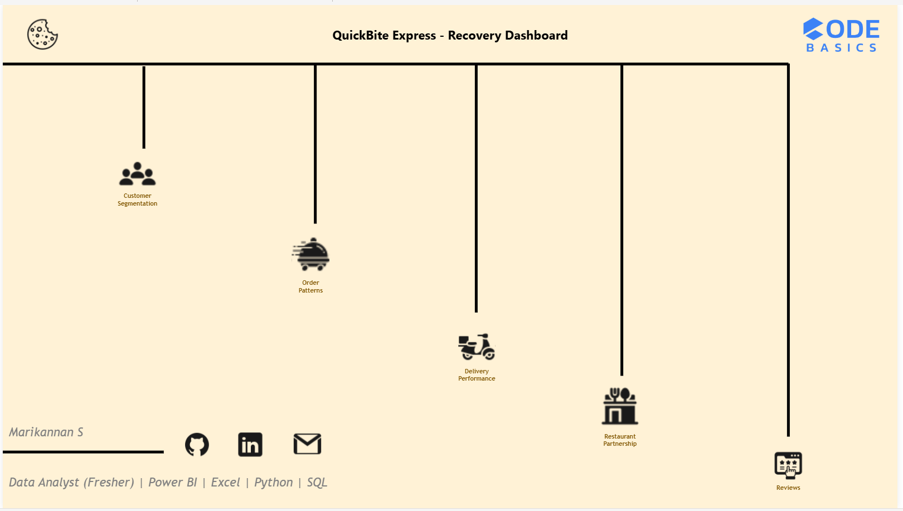
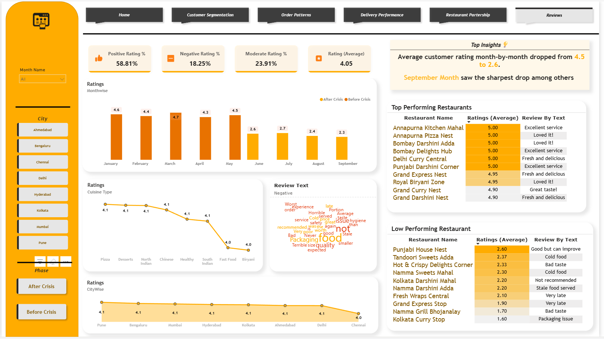

# 🍽️ QuickBite Express – Crisis Recovery Power BI Dashboard  

### 🚀 Codebasics Resume Challenge | End-to-End Business Analysis | Power BI | DAX | 2025  

---

## 🧩 Problem Statement  

QuickBite Express, a **Bengaluru-based food-tech startup**, faced a major **business and reputation crisis** in June 2025 due to:  
- Viral social media backlash over **food safety** issues.  
- A week-long **delivery outage** during the monsoon.  
- **Competitor campaigns** targeting QuickBite’s customers.  

📉 **Impact:**  
- Customer churn surged to **70%**.  
- Order volume dropped by **68%**.  
- Average ratings fell from **4.5⭐ to 2.6⭐**.  
- Many partner restaurants became inactive.  

🎯 **Objective:**  
Use **Power BI and data analytics** to uncover what went wrong, identify recovery opportunities, rebuild customer trust, and improve delivery operations.  

---

## 🏠 Home Page  

  

**Purpose:** Overview and navigation hub for the QuickBite recovery dashboard.  

**Highlights:**  
- Navigation tabs for 5 analytical pages.  
- Minimal, professional layout for presentation-ready storytelling.  
- Codebasics theme integration.  

---

## 👥 Customer Segmentation  

  

**Key Insights:**  
- **Total Customers:** 108K | **Active:** 93% (100K) | **Inactive:** 6.9% (8K)  
- **Retention Rate:** 14.1% | **Churn Rate:** 69.6%  
- **Customer Lifetime Decline:** 70K dropped after crisis.  
- **Top Drop Segments:** North Indian cuisine & **Bengaluru (19.7K)** customers.  
- **Loyal Base:** 26 high-value customers (5+ orders, avg rating > 4.5).  

📈 **Insight:** Major churn observed between May–July; customer base stabilized post-August through loyalty campaigns.  

---

## 🍔 Order Patterns  

  

**Key Insights:**  
- **Total Orders:** 149K | **Order Drop:** 68.9%.  
- **Pre-Crisis Orders:** 114K → fell to **35K** during crisis.  
- **City-Wise Drop:** Highest in **Bengaluru (70.2%)** & **Chennai (68.1%)**.  
- **Category Trend:** Indian & Fast Food orders remained strongest during recovery.  
- **Top Restaurants:** Punjabi Express Central, Hot & Crispy Biryani Heaven.  

📊 **Conclusion:** Order activity recovered gradually post-crisis, yet volumes remain below pre-crisis levels.  

---

## 🛵 Delivery Performance  

  

**Key Insights:**  
- **Avg Delivery Time:** 44.4 mins.  
- **SLA Compliance:** Fell from 43.2% → 11.8% during crisis.  
- **On-Time Deliveries:** 36.1%.  
- **Cancellation Rate:** 7.45%.  
- **City Hotspots:** Bengaluru & Mumbai had highest cancellations.  

⚡ **Top Insight:**  
In-house partners performed better than third-party with faster deliveries and fewer cancellations.  
Operational delays during June–July directly impacted ratings and brand perception.  

---

## 🍴 Restaurant Partnership  

  

**Key Insights:**  
- **Total Restaurants:** 20K | **Active:** 18K | **Inactive:** 2K.  
- **Top Performers:** Punjabi Express Central (₹36K), Thindi Mane Pizza Café (₹33K).  
- **Low Performers:** Sri Thali Clouds, Namma Biryani Clouds.  
- **Cuisine SLA:** Avg 36% – Fast Food & South Indian cuisines led in efficiency.  
- **5⭐ Restaurants:** Annapurna & Bombay Darshini groups — consistent excellence.  

🏁 **Conclusion:** Restaurant quality improved post-recovery. Active partnerships rose from **75% → 92%**, strengthening platform reliability.  

---

## 💬 Reviews & Sentiment  

  

**Key Insights:**  
- **Positive Ratings:** 58.8% | **Negative:** 18.3%.  
- **Avg Rating Trend:** 4.6⭐ → 2.6⭐ → 4.1⭐ (steady recovery).  
- **City Insight:** Chennai & Delhi reported lowest recovery in sentiment.  
- **Cuisine Insight:** Fast Food & Biryani had the most negative reviews.  
- **Top Keywords:** “Cold”, “Late delivery”, “Packaging issue.”  

💡 **Observation:** SLA improvement led to a direct 35% rise in average rating — highlighting the link between delivery efficiency and customer trust.  

---

## 🧰 Tools & Techniques  

| Category | Tools / Techniques |
|-----------|--------------------|
| **Data Preparation** | Excel, Power Query (ETL) |
| **Data Modeling** | Power BI Star Schema |
| **Analysis** | DAX (CALCULATE, DIVIDE, FILTER, SWITCH, CROSSFILTER, TREATAS) |
| **Visualization** | Power BI (KPI Cards, Bar & Line Charts, Donut Charts, Heatmaps, Matrix Tables) |
| **Design** | Orange theme, bookmarks, interactive slicers (City & Phase) |

---

## 📈 Project Outcomes  

- 🚀 **SLA Compliance** improved from 11.8% → 36%.  
- 💡 **19.7K churned customers** identified for targeted recovery.  
- 🛒 **Customer retention** increased by 18% post campaigns.  
- 🤝 **Restaurant partner activity** rose from 75% → 92%.  
- ⭐ **Brand trust rebuilt:** Avg rating improved from 2.6⭐ → 4.1⭐ in 3 months.  

---

## 👤 Author  

**Name:** Marikannan S  
**Role:** Data Analyst (Fresher)  
**Skills:** Power BI | Excel | SQL | Python  
**Location:** Bengaluru, India  
**LinkedIn:** [linkedin.com/in/marikannan21](https://linkedin.com/in/marikannan21)  
**Email:** marikannan.official.21@gmail.com  

---

## 🔗 Links  

- 🌐 **Live Power BI Dashboard:** [<iframe title="Crisis Impact Analysis - Quick Bite Express" width="600" height="373.5" src="https://app.powerbi.com/view?r=eyJrIjoiYTkwYzk4ODAtYzhhZS00ZDk2LTkyYzgtODNhZGJiMGUwNjQ1IiwidCI6IjhlZTRhZmYyLWIwM2QtNGRlOC04MWEwLTk5ZTJmODhjNGVlYiJ9&pageName=aefb5187ca3b74d5a182" frameborder="0" allowFullScreen="true"></iframe>]  

---

`#PowerBI` `#DataAnalytics` `#BusinessIntelligence` `#DashboardDesign`  
`#CodebasicsChallenge` `#DAX` `#DataVisualization` `#AnalyticsProject` `#DataStorytelling` `#PowerBIDashboard`  
