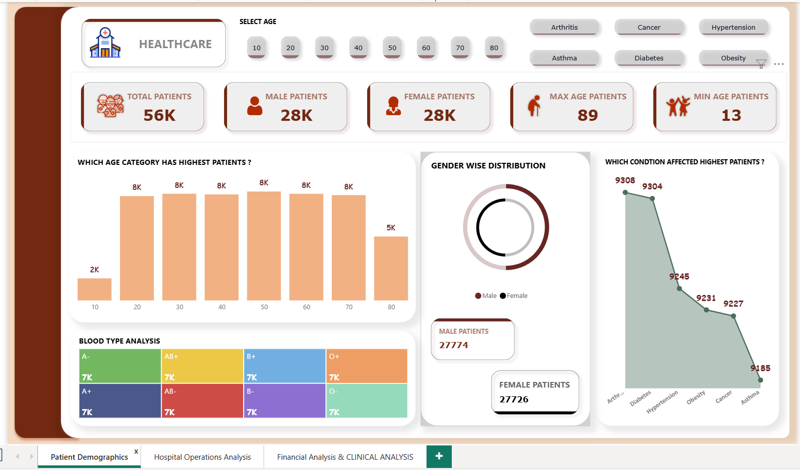
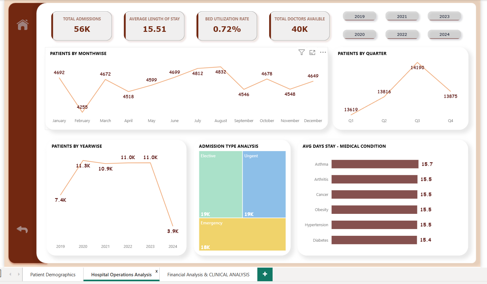

# 🏥 Healthcare Data Analysis (Power BI)

## 📌 Project Overview
This project focuses on analyzing healthcare data to generate actionable insights for hospital management.  
The analysis covers patient demographics, admissions, financial performance, and doctor/hospital efficiency.  
The dashboard helps in identifying trends, improving decision-making, and optimizing overall hospital operations.

---

## 📊 Analysis Covered

1. **Patient Demographics Analysis**  
   - Gender Distribution  
   - Age Group & Range Insights  
   - Common Medical Conditions  
   - Blood Type Analysis
   - 

2. **Hospital Operations Analysis**  
   - Admission Trends (Monthly, Quarterly, Yearly)  
   - Admission Types (Elective, Emergency, Urgent)  
   - Length of Stay Analysis  
   - Bed Utilization Rate
   - 

3. **Financial & Clinical Analysis**  
   - Revenue by Condition, Hospital & Insurance Provider  
   - Average Billing per Patient  
   - Medication Distribution  
   - Test Result Categorization (Normal, Abnormal, Inconclusive)
   - 
![Financial & Clinical Analysis].(images/Financial & Clinical.png)

---

## 🛠 Skills & Tools Used
- **Power BI** → Data modeling, DAX, interactive dashboards  
- **Excel** → Data cleaning & preprocessing  
- **Data Analysis** → Trend analysis, KPIs, performance evaluation  
- **Visualization Skills** → Building reports & storytelling with data  

---
