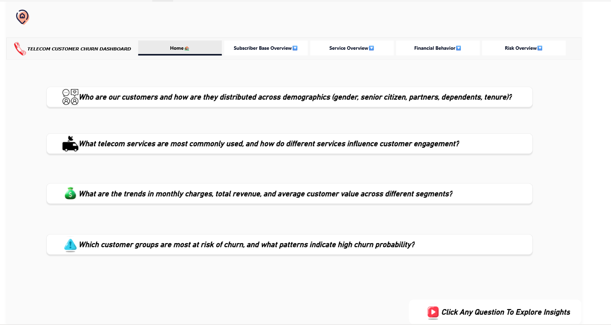

# 📊 Telecom Data Analysis Dashboard (Power BI)

### 🚀 Transforming raw telecom data into actionable insights for business growth and customer retention

---

## 🧩 Problem Statement

Telecom companies face increasing challenges in understanding customer behavior, optimizing service performance, and minimizing financial risks.  
Without clear visibility into subscriber base, service quality, and revenue trends, it becomes difficult to make informed business decisions.

---

## 🎯 Project Objective

The main objective of this project is to analyze telecom operational data using Power BI to:

- Gain insights into subscriber distribution and churn patterns  
- Evaluate service performance and customer usage trends  
- Track financial KPIs such as revenue, ARPU, and profit margins  
- Identify potential risks and areas for optimization  
- Deliver an interactive dashboard for data-driven decision-making

---

## 🗂️ Data Overview

| Dataset Component      | Description                                                |
|------------------------|------------------------------------------------------------|
| **Subscribers Data**   | Contains subscriber demographics, plan type, and usage behavior |
| **Services Data**      | Details of service categories, usage, and satisfaction metrics |
| **Financial Data**     | Tracks revenue, expenses, ARPU, and profit across periods |
| **Risk Data**          | Includes churn probabilities, complaint rates, and retention risk |

---

## 🧰 Tools & Technologies Used

- **Microsoft Power BI** → Data visualization & dashboard creation  
- **Power Query** → Data cleaning and transformation  
- **DAX (Data Analysis Expressions)** → Measure creation and KPI calculations  
- **Excel** → Data validation and preprocessing  

---

## 📄 Page-Wise Explanation / Insights

### 🏠 Home Page (Executive Summary)
- Provides a snapshot of key performance indicators from all sections  
- Highlights total subscribers, revenue, churn percentage, and satisfaction score  
- Acts as a navigation and insight hub for stakeholders
- 

---

### 👥 Subscriber Base Overview
- Analyzes customer distribution by region, plan type, and tenure  
- Identifies growth patterns and churn-prone segments  
- Helps in understanding customer demographics and loyalty trends  
**Outcome:** Clear visibility into where the largest customer bases and churn risks lie
  

---

### 📞 Service Overview
- Tracks usage by service type (voice, data, SMS, broadband, etc.)  
- Measures satisfaction and service performance levels  
- Identifies high-demand and low-performing services  
**Outcome:** Enables optimization of underperforming services and promotion of profitable ones

---

### 💰 Financial Overview
- Evaluates total revenue, cost, profit, and ARPU trends  
- Compares revenue across products, regions, and customer categories  
- Monitors profitability and identifies high-value customer groups  
**Outcome:** Helps management focus on profit-generating services and reduce cost leakages

---

### ⚠️ Risk Overview
- Examines churn rate, complaint frequency, and service reliability  
- Identifies high-risk regions, plans, and customer segments  
- Supports proactive retention strategies  
**Outcome:** Early detection of at-risk customers and service issues.

---

## 🧠 Skills Gained

- Power BI Dashboard Development  
- Data Modeling & Relationship Building  
- DAX Measure Creation & KPI Design  
- Business Performance Analysis  
- Customer & Risk Analytics  
- Storytelling with Data Visualization  

---

## 🏆 Key Achievements

- Built an **interactive dashboard** consolidating subscriber, service, financial, and risk metrics  
- Delivered **data-driven insights** enabling better decision-making and operational efficiency  
- Improved **reporting efficiency** through dynamic DAX-based measures and data automation  

---

## 💡 Outcome Summary

- 📈 Provided end-to-end visibility into business performance  
- 👥 Identified customer churn trends and risk hotspots  
- 💰 Helped stakeholders optimize revenue and service offerings  
- ⚙️ Enabled data-driven strategies for growth and retention  

---
## 🔗 Links

- **Live Power BI Dashboard:** [Click here to view]([YOUR_POWERBI_DASHBOARD_LINK](https://app.powerbi.com/view?r=eyJrIjoiNGJiODYzMjMtNTk1OC00YmEzLTkzZjctZjA0YTZhMWQ3NTA0IiwidCI6IjhlZTRhZmYyLWIwM2QtNGRlOC04MWEwLTk5ZTJmODhjNGVlYiJ9))  
- **LinkedIn Post:** [Click here to view](YOUR_LINKEDIN_POST_LINK)
- 
---
### 🧾 Author
**Marikannan.S** — Data Analyst  
📍 *Skilled in Excel | Power BI | SQL | Python | Data Storytelling*  
